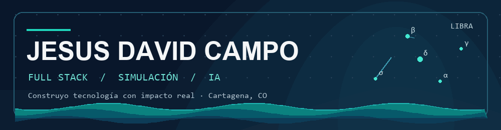
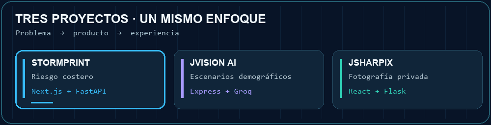
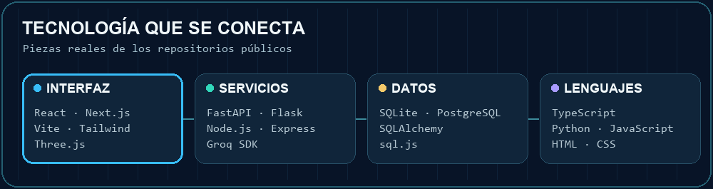
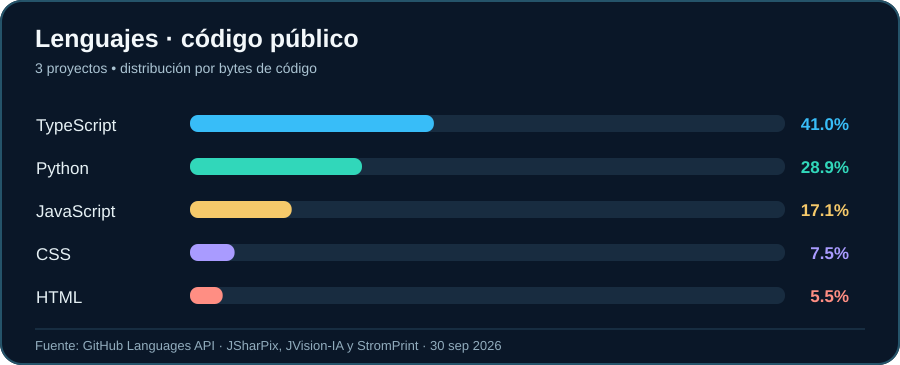

<div align="center">



<br />

<a href="https://git.io/typing-svg"></a>

<p><strong>Desarrollador full stack</strong> · Simulación · Visualización · Inteligencia artificial</p>

<a href="https://www.linkedin.com/in/jesusdavidcampo/"></a>
<a href="https://github.com/Jesussscy?tab=repositories"></a>

</div>

---

### 👋 Soy Jesus David

Me gusta tomar problemas complejos y convertirlos en experiencias claras: modelos que ayudan a entender un riesgo, datos que cuentan una historia y aplicaciones que resuelven una necesidad concreta. Trabajo de extremo a extremo, desde la interfaz y la API hasta la persistencia y el despliegue.

```text
Cartagena, Colombia  →  datos + diseño + código  →  productos con impacto real
```

### 🧭 Lo que construyo

| 01 · Simulación | 02 · Productos web | 03 · IA aplicada |
| :-- | :-- | :-- |
| Modelos y visualizaciones que hacen comprensibles los escenarios. | Interfaces cuidadas, APIs y datos que funcionan juntos. | Explicaciones y automatizaciones integradas en flujos útiles. |

### 🚀 Proyectos para explorar

<div align="center">



</div>

| Proyecto | Qué resuelve | Tecnologías comprobadas en el repositorio |
| :-- | :-- | :-- |
| **[🌊 StormPrint](https://github.com/Jesussscy/StromPrint)** | Simula y visualiza el riesgo de inundación en Manga, Cartagena, con un panel y un modelo 3D. | Next.js · React · TypeScript · Python · FastAPI · Three.js · SQLite/PostgreSQL |
| **[🧠 JVision AI](https://github.com/Jesussscy/JVision-IA)** | Explora escenarios demográficos y genera explicaciones con IA sobre datos de Bolívar. | HTML · JavaScript · Node.js · Express · Groq SDK · sql.js/SQLite |
| **[📸 JSharPix](https://github.com/Jesussscy/JSharPix)** | Ofrece una biblioteca fotográfica privada con perfiles, conexiones y control de visibilidad. | React · Vite · JavaScript · Python · Flask · SQLAlchemy · SQLite |

<details>
<summary><strong>Más proyectos y áreas en las que he trabajado</strong></summary>

<br />

- **SeaVector** · Simulación 3D de erosión costera hacia 2050. `Java` `Spring Boot` `React` `Three.js`
- **Eco de Mujeres** · Archivo digital de historias y audios de líderes comunitarias de Cartagena. `React` `Node.js` `SQLite`
- **Aurora IA** · Automatización de ventas por WhatsApp con IA. `Python` `FastAPI` `JavaScript`

Estas descripciones proceden de mi portafolio; los repositorios de estos proyectos no están enlazados públicamente aquí.

</details>

### 🛠️ Stack en proyectos públicos

<div align="center">



<br />


</div>

**Frontend** · React, Next.js, Vite, Tailwind CSS, Three.js, HTML y CSS<br />
**Backend y datos** · Python, FastAPI, Flask, Node.js, Express, SQLAlchemy, SQLite y PostgreSQL<br />
**Exploración** · simulación, visualización de datos, modelos físicos e integración de IA

### 📊 Los lenguajes detrás de mis proyectos públicos

<div align="center">



</div>

> Gráfica propia calculada con los bytes de lenguaje que reporta GitHub para [StormPrint](https://api.github.com/repos/Jesussscy/StromPrint/languages), [JVision AI](https://api.github.com/repos/Jesussscy/JVision-IA/languages) y [JSharPix](https://api.github.com/repos/Jesussscy/JSharPix/languages) el **30 de septiembre de 2026**. Es una foto del código público, no una medida de experiencia, tiempo dedicado ni repositorios privados.

### 📈 Actividad en GitHub

<div align="center">


<br />


</div>

---

<div align="center">

**¿Construimos algo juntos?**

<a href="https://www.linkedin.com/in/jesusdavidcampo/">Hablemos por LinkedIn</a> · <a href="https://github.com/Jesussscy?tab=repositories">Mira mi código</a>

<sub>Hecho desde Cartagena, entre código, datos y mar 🌊</sub>

</div>
